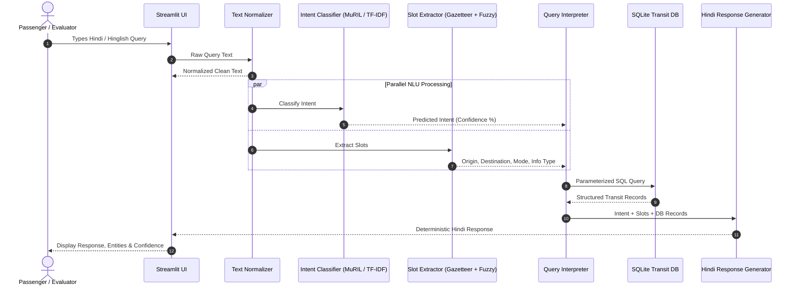
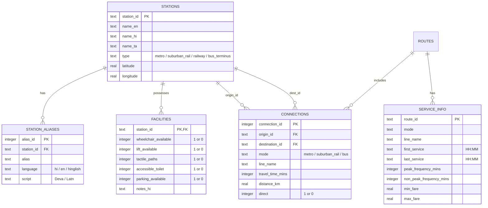

# System Architecture & Technical Specification

This document details the software architecture, data schemas, Natural Language Understanding (NLU) pipeline, and deterministic response generation logic for the **Hindi Multimodal Transport Assistant for Chennai**.

---

## 1. Architectural Philosophy

The architecture emphasizes **predictability, factual accuracy, and resource efficiency**:
1. **Zero Hallucination**: Generative Large Language Models (LLMs) are explicitly avoided in the response loop. Responses are synthesized from strictly verified SQLite database records using deterministic Hindi templates.
2. **Constrained Intent Taxonomy**: Intent classification predicts user goals (`route_query`, `service_availability`, `service_timing`, `station_information`, `accessibility`, `ticketing`, `out_of_scope`). Transport modes are extracted as slots, preventing combinatorial explosion in intent classes.
3. **Hybrid Slot Extraction**: High-precision gazetteers, alias dictionaries, and RapidFuzz fuzzy matching handle spelling variations, informal names, and Romanized script without requiring expensive token-level NER transformers.
4. **Local Execution**: The entire pipeline runs locally on standard CPU/GPU hardware without cloud API network dependencies.

---

## 2. End-to-End Pipeline Dataflow

---

## 3. Database Schema (SQLite: `data/processed/transport.db`)

---

## 4. Intent & Slot Taxonomy

### 4.1 Supported Intents
1. **`route_query`**: Navigation directions between two geographic points (e.g., `चेन्नई सेंट्रल से एयरपोर्ट कैसे जाऊँ?`).
2. **`service_availability`**: Confirmation whether a specific transit mode connects two locations (e.g., `सेंट्रल से गिंडी के लिए मेट्रो उपलब्ध है?`).
3. **`service_timing`**: Operating hours, first/last departure times, and frequencies (e.g., `रात को आखिरी मेट्रो कब है?`).
4. **`station_information`**: General station amenities, platforms, parking, and transit interchanges (e.g., `एग्मोर स्टेशन पर क्या सुविधाएं हैं?`).
5. **`accessibility`**: Step-free access, elevators, ramps, wheelchair provisions, and tactile paving (e.g., `क्या इस स्टेशन पर लिफ्ट और व्हीलचेयर उपलब्ध है?`).
6. **`ticketing`**: Ticket purchasing, fares, smart cards, token rules, and concessions (e.g., `मेट्रो का न्यूनतम किराया क्या है?`).
7. **`out_of_scope`**: Topics unrelated to Chennai public transit (e.g., `चेन्नई में आज मौसम कैसा है?`).

### 4.2 Entity / Slot Definitions

| Slot Key | Type | Example Values | Extraction Method |
| :--- | :--- | :--- | :--- |
| `origin` | Canonical Station ID | `CHENNAI_CENTRAL`, `EGMORE`, `GUINDY` | Gazetteer alias lookup + RapidFuzz |
| `destination` | Canonical Station ID | `AIRPORT`, `TAMBARAM`, `KOYAMBEDU` | Gazetteer alias lookup + RapidFuzz |
| `transport_mode` | Categorical String | `metro`, `bus`, `suburban_rail`, `railway` | Keyword dictionary + Regex |
| `information_type` | Categorical String | `wheelchair`, `lift`, `timing`, `fare`, `parking` | Keyword dictionary + Regex |

---

## 5. NLU Modules

### 5.1 Normalization (`src/normalization.py`)
- Standardizes Unicode characters using `unicodedata.normalize('NFC', text)`.
- Normalizes Hindi Nuqta characters (e.g., `क़` → `क`, `फ़` → `फ` where needed for robust matching).
- Normalizes Devanagari punctuation (e.g., Purna Viram `।` to whitespace).
- Lowers Roman characters for Hinglish queries while preserving Devanagari codepoints.

### 5.2 Entity Extraction (`src/entity_extractor.py`)
- **Longest String Matching**: Scans query text for longest matching aliases first to prevent partial conflicts (e.g., `चेन्नई सेंट्रल` matches before `सेंट्रल`).
- **Directional Adposition Resolution**: Uses Hindi postpositions (`से` = from/origin, `को`/`तक`/`के लिए` = to/destination) to assign extracted station entities to `origin` and `destination` slots.
- **Fuzzy Fallback**: Employs RapidFuzz token set ratio (threshold ≥ 85) to recover slightly misspelled station names (e.g., `एयरपोट` → `AIRPORT`, `ताम्बरम` → `TAMBARAM`).

### 5.3 Intent Classification (`src/intent_classifier.py`)
- **Baseline**: Scikit-Learn pipeline with combined Word n-grams (1, 3) and Character n-grams (2, 5) passed into an L2-regularized Logistic Regression classifier.
- **Transformer**: Hugging Face `AutoModelForSequenceClassification` loaded with `google/muril-base-cased`, fine-tuned using Cross-Entropy Loss with AdamW optimizer on the local RTX 4000 Ada GPU.

---

## 6. Deterministic Response Generation (`src/response_generator.py`)

Responses are mapped through parameterized Hindi templates based on retrieved database facts:

### Sample Generation Rules

#### Case A: Route Query (`route_query`)
- *DB Result*: Metro Blue Line, Direct, 40 mins, ₹40 fare.
- *Template*:
  > `{origin_hi} से {destination_hi} जाने के लिए आप {line_name} ({mode_hi}) ले सकते हैं। यात्रा में लगभग {time} मिनट लगते हैं और किराया ₹{fare} है।`

#### Case B: Accessibility Query (`accessibility`)
- *DB Result*: Koyambedu, `wheelchair=1`, `lift=1`.
- *Template*:
  > `हाँ, {station_hi} स्टेशन पर लिफ्ट और व्हीलचेयर सहायता उपलब्ध है। विशेष सहायता के लिए स्टेशन कंट्रोलर या कस्टमर केयर से संपर्क करें।`

#### Case C: Out of Scope (`out_of_scope`)
- *Template*:
  > `क्षमा करें, मैं केवल चेन्नई सार्वजनिक परिवहन (मेट्रो, उपनगरीय ट्रेन, बस रूट एवं स्टेशन सुविधाओं) से संबंधित प्रश्नों में सहायता कर सकता हूँ।`

#### Case D: Missing Destination Slot
- *Template*:
  > `आप {origin_hi} से कहाँ जाना चाहते हैं? कृपया अपने गंतव्य (destination) स्टेशन का नाम बताएं।`

---

## 7. Error Handling & Edge Cases

1. **Unknown Station**: When a location entity is detected but does not match any gazetteer entry (fuzzy score < 80):
   - *Message*: `मुझे यह स्टेशन या स्थान नहीं मिला। कृपया चेन्नई मेट्रो या उपनगरीय रेलवे के किसी मान्य स्टेशन का नाम दें।`
2. **Ambiguous Postposition**: When two stations are present without clear `से`/`तक` markers:
   - System assumes first mentioned station is `origin` and second is `destination`.
3. **Live Status / Delays**: When user asks for real-time tracking (`ट्रेन लेट है क्या?`):
   - *Message*: `यह प्रोटोटाइप केवल आधिकारिक समय-सारणी (static schedule) प्रदान करता है, लाइव ट्रेन या बस ट्रैकिंग उपलब्ध नहीं है।`
