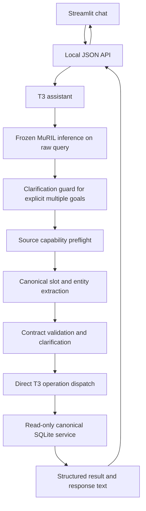

# Production T3 architecture

The default application uses T3 Direct Dispatch with the 16 frozen labels. The earlier seven-label pipeline and T2 research code remain historical entry points.

```mermaid
flowchart TD
    UI[Streamlit chat] --> API[Local JSON API]
    API --> A[T3 assistant]
    A --> M[Frozen MuRIL inference on raw query]
    M --> G[Clarification guard for explicit multiple goals]
    G --> C[Source capability preflight]
    C --> S[Canonical slot and entity extraction]
    S --> V[Contract validation and clarification]
    V --> D[Direct T3 operation dispatch]
    D --> KB[Read-only canonical SQLite service]
    KB --> R[Structured result and response text]
    R --> API
    API --> UI
```

## Modules and boundaries

| Layer | Source | Contract |
|---|---|---|
| Model | `src/nlp_v2/model.py`, `models/nlp_v2_t3_manifest.json` | Strict checkpoint SHA, pinned MuRIL revision, fixed index order, raw query, length 64, CPU inference. Missing assets fail startup; no alternate model fallback. |
| Extraction | `src/nlp_v2/entities.py`, `src/nlp_v2/slots.py` | Exact canonical names/curated multilingual aliases, explicit directional and temporal cues, bounded frozen enums; unknown aliases are unresolved. |
| Validation | `src/nlp_v2/contracts.py`, `src/nlp_v2/dispatch.py` | Intent-specific slot allowlists/requirements and separate intent, entity, temporal, missing-slot and multiple-goal clarification reasons. |
| Domain | `src/nlp_v2/domain.py` | Parameterized, read-only queries against `data/canonical/transit/canonical_transport.db`; source/provisional metadata and explicit unavailable states. |
| Assistant | `src/nlp_v2/assistant.py` | One utterance-to-reply path. Normalized text supports extraction; model inference preserves raw multilingual input. The explicit-conjunction guard requests clarification only and never chooses a successful operation. |
| API | `app/api.py` | `GET /health`, `POST /api/v2/query`; localhost by default, 8 KiB request bound, finite socket timeout, safe errors, no raw text/confidence/exception internals in replies. |
| UI | `app/frontend_contract.py`, `app/streamlit_app.py` | HTTP client, reply-shape validation and structured panels; no transport computation. A clarification requires a revised full query. |

The API is a single-threaded local demo server. Authentication, public hosting, conversational slot memory, speech, and translation are outside this implementation. API/model/database startup errors are visible; per-query execution failures return safe error objects.

## Frozen intent-to-operation behavior

| T3 intent | Operation | Current snapshot behavior |
|---|---|---|
| `point_to_point_route` | `PLAN_ROUTE` | Directional published stop-sequence candidates, with optional via/route/mode filters; no verified optimal-trip claim. |
| `multimodal_route` | `PLAN_MULTIMODAL_ROUTE` | Unavailable: confirmed cross-mode transfer graph absent. |
| `route_stop_sequence` | `LIST_ROUTE_STOPS` | Published, mode-consistent directional stop lists using route number or line name. |
| `route_stop_membership` | `CHECK_STOP_ON_ROUTE` | Bounded positive membership; negative membership requires complete mode-consistent topology across all candidate variants. Ambiguous physical stops remain candidates. |
| `first_and_last_service` | `GET_FIRST_LAST_SERVICE` | Published schedule bounds with station, destination, route/mode and calendar constraints. |
| `service_frequency` | `GET_SERVICE_FREQUENCY` | Median interval for one published route/direction/physical-stop group; requested clock uses a two-hour window. Unresolved direction ambiguity is not merged. |
| `scheduled_departure` | `GET_SCHEDULED_DEPARTURES` | Up to five published departures at/after the requested clock, preserving destination/calendar constraints. |
| `mode_availability` | `CHECK_SERVICE_AVAILABILITY` | Positive ordered published connectivity with sources; current or dated/timed operation is unconfirmed and refused. |
| `fare_calculation` | `CALCULATE_FARE` | Dated metro station-pair token records or bus stage/service-class records. Unsupported concession/ticket rules are unavailable. |
| `ticketing_and_passes` | `GET_TICKETING_POLICY` | Unavailable: authoritative policy table absent. |
| `station_facilities` | `GET_STATION_FACILITY` | Unavailable: facility availability is unverified in the current snapshot. |
| `station_accessibility` | `GET_ACCESSIBILITY_INFO` | Nullable feature records; current snapshot has no affirmative verified coverage. |
| `interchange_transfer` | `GET_INTERCHANGE_DETAILS` | Only confirmed transfer rows; current interchanges are unconfirmed. |
| `nearest_transport` | `FIND_NEAREST_STATION` | Mode-specific straight-line distance from exact canonical place/stop/hub coordinates. MRTS and suburban rail remain distinct; walking access/current operation are unverified. |
| `realtime_status_query` | `REJECT_UNSUPPORTED_REALTIME` | Explicit live-data unavailable response. |
| `out_of_scope` | `REJECT_OUT_OF_SCOPE` | Explicit rejection without domain lookup. |

## Temporal and entity semantics

Canonical IDs pass between backend layers. Explicit source prepositions/postpositions determine journey direction; otherwise mention order is used. Mode and route context can disambiguate matching nodes, but cannot remove an explicitly identified incompatible/off-route stop and silently widen the query. The snapshot has duplicate Central hubs and unverified hub memberships, which can cause conservative clarifications or provisional route candidates.

`08:00`, `08:00:30`, and explicit AM/PM clocks normalize deterministically. Bare `8 baje`/`8:00 baje` retain AM/PM alternatives. Invalid parsed clocks/dates request clarification. Unresolved `kal`/`परसों` also request clarification. Scheduling resolves today/tomorrow/yesterday using Chennai's Asia/Kolkata date per request, or an injected fixed reference date in evaluation. GTFS output can exceed 24:00; this is service-day notation.

## Evaluation and governance

Model selection used validation only. Existing frozen train/validation data share families; the replacement trainer excludes overlapping validation rows without altering source CSVs. Frozen stress/reference sets also share train families, and the human subset is nested in stress. Reports disclose those integrity limitations.

The selected model was frozen before model-only evaluation. The complete assistant was frozen at `b9b2271b1761d08752786f22b558862f45ed1dac` before the final aggregate assistant run. Reports distinguish model accuracy, selected operation, actual terminal dispatch, status counts, and clarification behavior. They do not claim slot or factual-answer accuracy. That historical report is the baseline. Phases11–20 improve only against a separately frozen development suite and allowed validation, without individual held-out inspection. Phase17 ran one full GPU candidate selected on disjoint validation; it failed the comparison and the original model remains selected. The next source-frozen run is post-development descriptive regression evaluation, not an untouched estimate; its results cannot drive further backend tuning.

Use the [runbook](docs/nlp_v2/production_runbook.md) for asset preparation, startup, tests, safe training, and demo steps. Historical evidence remains in the existing Gate B.2/B.3 directories.

## Operational outcomes and artifacts

Optional capability preflight avoids questions that cannot change source answerability; extended handlers retain authority. Replies expose `outcome_reason` separately from status/intent/operation for actionable missing inputs, ambiguity, unsupported source, external realtime, malformed requests and temporary failures. Exact extraction normalization stays separate from raw inference. The selected weights remain ignored and are supplied through the [validated artifact workflow](docs/nlp_v2/model_artifact_workflow.md); no automatic fallback or upload occurs. The [development matrix](docs/nlp_v2/development_acceptance.md) distinguishes actual coverage from intended-intent downstream reachability.
