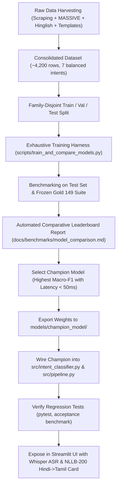

# Design Specification: Exhaustive Multi-Model Evaluation, Data Expansion, and Multimodal Extensions

**Date:** 2026-09-17  
**Status:** Proposed / Under Review  
**Target Hardware:** NVIDIA RTX 4000 Ada Generation (20 GB VRAM, CUDA 12.4)  
**Budget & Constraints:** ₹0 cost, 100% open-source local models, no paid API keys.

---

## 1. Executive Summary & Goals

The Chennai Hindi Multimodal Transport Assistant currently operates on a verified SQLite database (13 CMRL stations, 70 aliases, 100% factual accuracy on gold acceptance suites) with a high-precision TF-IDF + rule-based baseline (0.35 ms latency).

This design specification details the architecture to:
1. **Exhaustively expand datasets** from multiple sources (scraped Chennai public transit pages, Amazon MASSIVE Hindi `hi-IN`, Hinglish conversational datasets, and expanded synthetic combinatorial generators) yielding $\ge 4,000$ diverse samples.
2. **Train and benchmark 8 distinct open-source models** on an NVIDIA RTX 4000 Ada GPU across both synthetic holdouts and the frozen 149-query gold acceptance benchmark.
3. **Select the champion model** using a multi-objective Pareto frontier (Intent Macro-F1 $\ge 0.95$, Factual E2E Success $\ge 95\%$, Inference Latency $< 50$ ms).
4. **Incorporate multimodal capabilities**:
   - Local zero-cost Hindi Speech-to-Text via **OpenAI Whisper** (`whisper-base`).
   - Local zero-cost Hindi-to-Tamil Translation via **Meta NLLB-200** (`facebook/nllb-200-distilled-600M`).

---

## 2. Data Acquisition & Expansion Strategy

To ensure models generalize across formal Hindi, colloquial dialectal queries, and code-mixed Latin Hinglish, data will be aggregated from four distinct pipelines:

```
+---------------------------------------------------------------------------------------+
|                                DATA HARVESTING PIPELINES                              |
+---------------------------------------------------------------------------------------+
| [A. Transit Scraper]     | [B. MASSIVE hi-IN]      | [C. Hinglish Dialogues] | [D. Template Engine] |
| Official CMRL FAQs,     | Amazon MASSIVE          | Colloquial Hinglish     | Combinatorial slot   |
| MTC bus queries,         | Transport, Datetime,    | conversational corpora  | replacement with 70  |
| Suburban rail guides     | & OOS intents           | (transliterated transit)| aliases & 7 classes  |
+--------------------------+-------------------------+-------------------------+----------------------+
                                            |
                                            v
+---------------------------------------------------------------------------------------+
|                               CONSOLIDATION & FILTERING                               |
| - De-duplication, script tagging (Devanagari vs. Latin), length normalization         |
| - Balanced intent distribution: ~600 samples per intent across 7 classes (~4,200 total)|
| - Strict family-disjoint split: Train (70%), Validation (15%), Test Holdout (15%)     |
| - Independent benchmark: Frozen Gold Acceptance Suite (149 queries) untouched         |
+---------------------------------------------------------------------------------------+
```

### 2.1 Pipeline A: Real Chennai Transit Data Scraping & Extraction
- **CMRL Metro Rail Web Portal & FAQs**: Extract passenger guidelines, ticketing rules (smart cards, NCMC, tokens), accessibility policies (wheelchair assistance, lifts, ramps), and line interchange details.
- **MTC Bus & Suburban Rail Public Advisories**: Common commuter questions regarding bus routes connecting to metro stations (e.g., Central, Koyambedu, Guindy, Airport).

### 2.2 Pipeline B: External Multi-domain Corpus Integration (Amazon MASSIVE)
- Integrate Hugging Face `AmazonScience/massive` (Hindi `hi-IN` subset).
- Map relevant transit, time, calendar, and general question intents into our 7 target classes (`route_query`, `service_availability`, `service_timing`, `station_information`, `accessibility`, `ticketing`, `out_of_scope`).
- Provides realistic human natural-language variation that synthetic templates cannot replicate.

### 2.3 Pipeline C: Code-Mixed Hinglish Conversational Harvesting
- Harvest Romanized Hindi/Hinglish commuter queries (e.g., `"Central se airport metro timing kya hai?"`, `"Koyambedu me wheelchair milegi?"`).
- Ensure phonetic and spelling variations are represented (e.g., `milegi`, `mil sakti hai`, `chalegi`, `available hai`).

### 2.4 Pipeline D: Combinatorial Template Expansion
- Expand `data/templates/hindi_templates.json` to cover $> 40$ distinct query families per intent.
- Generate diverse permutations across all 13 canonical stations and 70 aliases.

---

## 3. Candidate Model Lineup & Theoretical Motivations

All models will be evaluated under identical conditions on the RTX 4000 Ada GPU using mixed precision (`fp16`).

| # | Model Identifier | Architecture | Parameters | Literature Motivation / Strengths |
|---|---|---|---|---|
| **1** | **TF-IDF + LogisticRegression** | Word (1-3) + Char (2-5) | ~1.5 MB | Current production baseline; deterministic, ultra-low latency (< 1 ms), strong lexical anchor. |
| **2** | **`google/muril-base-cased`** | BERT-base | 237M | Google Research (*Khanuja et al., 2021*); trained on 17 Indian languages with parallel transliterated text. Canonical SOTA for code-mixed Hinglish. |
| **3** | **`ai4bharat/IndicBERTv2-MLM-only`** | BERT-base | 278M | AI4Bharat (*Doddapaneni et al., 2023*); trained on IndicCorp v2 (20.9B tokens across 24 Indic languages). Leading model on pure Devanagari benchmarks. |
| **4** | **`ai4bharat/indic-bert`** | ALBERT | 12M | AI4Bharat (*Kakwani et al., 2020*); extreme parameter efficiency (~33 MB weights), ideal for edge or CPU deployment. |
| **5** | **`l3cube-pune/hing-bert`** | BERT-base | 110M | L3Cube Pune (*Joshi et al., 2022*); trained exclusively on Romanized Hindi-English conversational social data (*L3Cube-HingCorpus*). |
| **6** | **`xlm-roberta-base`** | RoBERTa-base | 278M | Meta AI (*Conneau et al., 2020*); gold-standard cross-lingual language model trained on 2.5TB CommonCrawl across 100 languages. |
| **7** | **`microsoft/mdeberta-v3-base`** | DeBERTa-v3 | 278M | Microsoft (*He et al., 2021*); uses disentangled attention and replaced token detection (RTD). Often dominates cross-lingual NLU leaderboards. |
| **8** | **`sentence-transformers/paraphrase-multilingual-MiniLM-L12-v2`** | MiniLM | 117M | Sentence-Transformers; distilled transformer designed for high semantic fidelity with sub-5 ms CPU inference. |

---

## 4. Multimodal Components

### 4.1 Speech-to-Text: OpenAI Whisper (`openai/whisper-base`)
- Runs locally on GPU via Hugging Face `pipeline("automatic-speech-recognition", model="openai/whisper-base")`.
- Directly decodes Hindi and Hinglish spoken audio to Devanagari/Latin text.
- Integrated into Streamlit with an interactive microphone recorder.

### 4.2 Machine Translation: Meta NLLB-200 (`facebook/nllb-200-distilled-600M`)
- Solves a core real-world pain point: Hindi-speaking passengers arriving in Chennai who need to show a question/request to Tamil-speaking MTC conductors, auto drivers, or metro staff.
- Translates assistant responses and user intent from `hin_Deva` to `tam_Taml` locally on GPU with no latency impact on the core NLU loop.

---

## 5. Benchmarking Methodology & Evaluation Metrics

Each candidate model will be subjected to dual evaluations:

### 5.1 Benchmark A: Synthetic Held-Out Test Set (Unseen Template Families)
- $N \approx 600$ test samples with zero lexical or template family overlap with training data.
- Measures raw generalization and robustness against overfitting.

### 5.2 Benchmark B: Frozen Gold Acceptance Suite (149 Human-Curated Cases)
- Real-world distribution across 7 intents, 4 linguistic styles (Devanagari Formal, Devanagari Colloquial, Hinglish Transliterated, Hinglish Code-Mixed), out-of-scope adversarial prompts, and complex station aliases.

### 5.3 Quantitative Metrics
1. **Intent Macro-F1**: Unweighted mean of F1 scores across all 7 intent classes.
2. **Intent Accuracy**: Exact class accuracy.
3. **Slot Extraction Exact Match**: Strict token-level entity match on origin, destination, station, mode, and facility.
4. **End-to-End Factual Success Rate**: Percentage of queries producing factually accurate, non-hallucinatory, schema-compliant responses.
5. **Inference Latency**:
   - Mean latency (ms) over 100 iterations.
   - P95 latency (ms).
6. **Model Footprint**: Disk size (MB) and peak GPU VRAM allocation (MB).

---

## 6. Champion Selection & Integration Workflow



---

## 7. Risks & Mitigations

| Risk | Consequence | Mitigation |
|---|---|---|
| **Tokenizer Fragmentation on Indic Scripts** | Subwords split excessively, reducing context window and accuracy. | Use models specifically tokenizer-adapted for Indic scripts (`MuRIL`, `IndicBERTv2`). |
| **GPU Out-of-Memory during large batch training** | Training crashes. | RTX 4000 Ada has 20 GB VRAM; batch size 32 with `fp16` consumes $< 4$ GB VRAM per model. |
| **Hinglish Token Mismatch** | Models trained solely on Devanagari fail on Romanized Latin text. | Benchmark `MuRIL` and `l3cube-pune/hing-bert`, both explicitly pretrained on transliterated and Romanized Hinglish corpora. |
| **Regression on Gold Acceptance Suite** | Deep learning model slips below 100% on specific edge cases. | Maintain the hybrid fallback architecture: high-confidence rule heuristics (`confidence >= 0.85`) combined with deep model predictions. |
