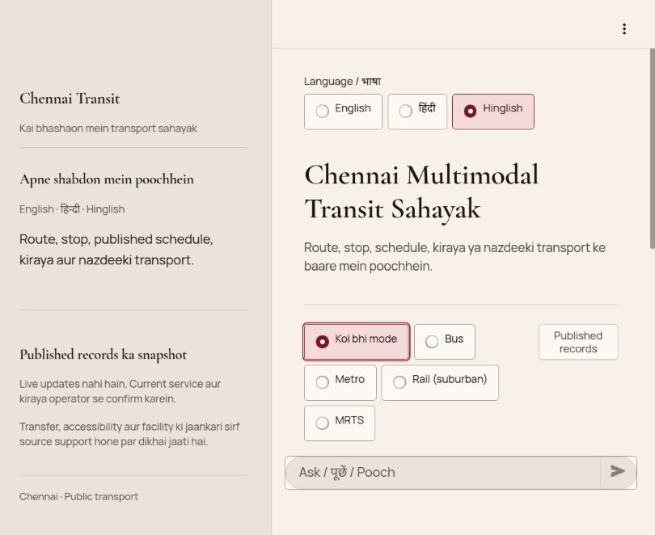
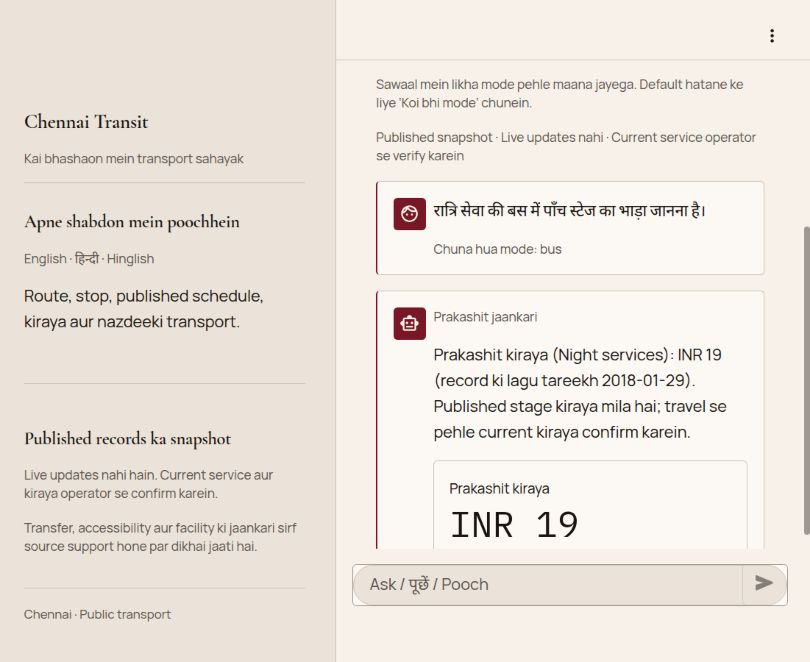

# 200 Hindi + 200 Hinglish custom product QA

**Testing is complete; perfect multilingual understanding is not achieved.** All 400 authored questions were submitted to the actual API and replayed through the website. Every rendered question and localized reply matched the final API presentation. Manual semantic review still records 175 recognition failures, 162 source/scope limitations and 3 cases requiring source/anchor review.

The original parchment/oxblood UI now has functioning Any mode / Bus / Metro / Rail (suburban) / MRTS choices and a Published records coverage button. A selected mode applies as a separate default to subsequent questions; an explicit typed mode takes priority. Any mode clears the default. Language changes preserve selected mode, saved history and unsent composer drafts. Font roles and colors are shared across body text, headings, controls, forms, alerts, captions, fare values and tables, including Hindi fallbacks. A live audit caught and corrected Streamlit's nested fare value overriding the numeric font.

## Final semantic results

These are manually reviewed, deliberately varied development challenge cases, **not independent accuracy estimates**. A correct unavailable response or legitimate clarification does not count as completed transport-goal fulfillment. Wrong-family refusals and requests for already supplied inputs remain recognition failures. Out-of-scope rejections count as safe limitations. Dated fares, structured stop sequences and geometric nearest answers are credited only within their explicitly bounded source scope.

| Outcome | Hindi baseline | Hindi verified | Hinglish baseline | Hinglish verified |
|---|---:|---:|---:|---:|
| Completed bounded published-data goal | 5 | 10 | 8 | 12 |
| Correct source/scope limitation | 83 | 90 | 72 | 72 |
| Legitimate clarification | 14 | 16 | 19 | 22 |
| Recognition failure | 95 | 83 | 99 | 92 |
| Explicit wrong/unsafe answer | 3 | 0 | 1 | 0 |
| Needs source/anchor review | 0 | 1 | 1 | 2 |
| Total | 200 | 200 | 200 | 200 |

The final zero in the explicit-wrong-answer row does not establish safety or accuracy: three uncertain factual cases remain under review, and the classifier/extractor still fails many questions. The original independent Hinglish review counted two correct domain rejections as goal success; a separate normalized baseline moves HG200_182/183 to safe limitation. Original assessments remain unchanged.

[Per-case semantic comparison CSV](semantic_comparison.csv), [counts](semantic_counts.json), [Hindi final manual review](hindi/verified_assessment.json), [Hinglish final manual review](hinglish/verified_assessment.json), and [remaining work](remaining_work.md) explain each judgment. Byte-identical final replies reuse the independent original manual review; every changed response (23 Hindi, 22 Hinglish) was manually reviewed against its authored query/expectation and full actual JSON. Status or intent equality alone was never a pass rubric.

## Fixes found through testing

- Unicode word boundaries retain combining marks: लोकल no longer invents कल. Explicit बसें/बसों, लोकल रेल and उपनगरीय rail modes survive extraction.
- Explicit route labels संख्या/क्रमांक and possessive alphanumeric bus codes retain complete suffixes. The 25R departure case stops returning unrelated routes, although its last-service intent remains misclassified.
- Native digits, Hindi/Roman/English cardinal and bounded ordinal fare counts support stages 1–30 before or after stage/चरण. Invalid and conflicting values clarify instead of being truncated or silently bypassed. रात्रि सेवा selects Night, and an explicitly unknown service class requests that class.
- Explicit numeric सुबह/subah, दोपहर/dopahar, शाम/shaam and रात/raat periods are respected across clock forms. Conflicting or ambiguous clocks clarify.
- A predicted goal explicitly excluded by the question is guarded from execution; no alternate intent is selected by rules. Stop-list plus actual live-location goals clarify before partial execution. Negative availability/membership propositions remain valid questions.
- Generic Bus Stop target aliases no longer become nearest-query anchors. Unqualified campus/locality and source mode-label issues remain open; they are not credited as completed factual goals.

The user's original **“guindy se central kaise jau”** is recognized as point-to-point routing. With Metro or Rail selected, the actual API reports absent published mode topology; with Any mode or Bus, canonical stop clarification remains necessary. A complete itinerary is still unavailable. [Actual probes](browser/reported_query_api.json) preserve that result.

## API, browser and software evidence

- Two independent agents authored 200 unique Hindi and 200 unique Hinglish cases with expectations before predictions, covering the 16 T3 families and contrasting missing/negated/multiple/ambiguous scopes. The primary agent coordinated real API calls and all browser replay. A third agent audited root causes/theme. Agent usage allowance ended before independent final source signoff; [final source review](source_review.md) is explicitly a primary-agent review.
- Final `verified` API campaign: 400 HTTP 200 replies, zero request transport errors, exact authored questions sent as the query field with no selected default. [Manifest](verified_manifest.json) records source/case/response hashes and timestamps. [Hindi CSV](hindi/verified.csv), [Hindi JSON](hindi/verified.json), [Hinglish CSV](hinglish/verified.csv), [Hinglish JSON](hinglish/verified.json) contain the actual public contract, full data and expectations.
- Browser: 200 Hindi + 200 Hinglish real composer submissions; all 400 normalized displayed questions and localized replies matched final API replies. [Summary](browser/verified_replay_summary.json), [CSV](browser/verified_replay.csv), [JSON](browser/verified_replay.json) preserve rendered exchanges. Root-owned test history was cleared every 50 cases for bounded page size. This verifies presentation, not factual goal correctness.
- Actual UI/API mode-default and typed-mode override checks pass for Bus/Metro/Rail/MRTS. Language changes preserve mode/history. Draft text remains intact without submission while changing language and mode. Published records opens/closes coverage. A brief task-owned API outage produces a localized error with the shared semantic alert palette; the API was restored to healthy state afterwards. [Mode UI evidence](browser/mode_controls.json), [final API mode evidence](browser/live_mode_api_verified.json), [draft evidence](browser/draft_language_mode_check.json), [offline UI evidence](browser/offline_ui_check.json).
- Default and phone layout inspected; radio/button targets are about 44 CSS pixels high with no horizontal overflow at the observed phone viewport. Native browser scaling yielded 287×620 CSS pixels for the requested 390×844 override; the audit records actual dimensions and the override was reset. [Phone audit](browser/phone_audit.json), [phone screenshot](browser/phone-controls.jpg), [font audit](browser/font_audit_hindi.json), [corrected metric audit](browser/metric_font_corrected.json), [source panel screenshot](browser/records-panel-hindi.jpg). No claim of an unobserved exact device geometry is made.
- Fresh closed-source full suite: **1,344 passed in 40.91s**. [Full log](full_pytest_closed_source.txt). Compile, dependency and diff checks pass; no configured lint/type checker. Tests cover software contracts and strict retained-checkpoint inference, not broad NLP accuracy. Relevant RED logs and intermediate failures remain for traceability.

## Source and preservation

Baseline: `3336e0d4ed0f84ddc706bf14cbf1aaa1e5c33a4c`. Bounded language/mode/theme fixes: `145f997`; final excluded-stop-list guard/API source: `3ed0c33`; final nested numeric-font correction/UI source: `597bf91`. Python source hashes in the final API manifest match the closed source. The later UI change affects CSS only.

`baseline`, `postfix` and `final` campaigns are preserved as intermediate evidence; **`verified` is the accepted final result**. In particular, the postfix replay revealed an Ordinary fallback for Hindi Night service, and the final replay revealed a newly executable excluded stop list; both were corrected and covered with failing-before/passing-after regressions before the verified run. Do not attribute intermediate outcomes to the final source.

[Source context](source_context.json) verifies unchanged checkpoint, canonical database, model manifest, development suite, six retained model/resolver/domain/contract modules and 10 historical report/context hashes. No historical research data, individual protected evaluation item, alias table, domain handler, model artifact, taxonomy, training or research evaluator was changed/run. Current custom QA is observed development evidence; historical metrics are not reattributed to this source.

The restarted local API uses OMP/MKL thread caps of 2 for this QA environment. Timing is diagnostic only and not a latency benchmark; model and request semantics are unchanged. All requested exports live inside this repository.

## Final browser proof

